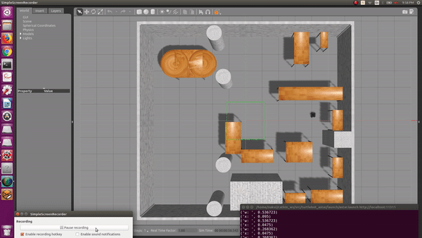

# Astar Algorithm for differential drive robot

## 1 Overview and Instructions:

### 1.1 Overview

The goal of this project is to implement A* alogithm for a differential drive robot, by incorporating the differential drive constraints in the original A* algorithm.

This repository contains following files:
1) src (ROS Package)
2) Output Videos of simulation
3) Readme file


### 1.2 Dependencies

* ROS Kinetic
* Python 3.x
* NumPy
* OpenCV 3.x
* Matplotlib

### See how it works:

This is a short animation of the Astar algorithm running on Turtlebot from a start position to end position(both are user specified) in the Gazebo world.




## 1.3 Output Videos

The output videos can be accesses here:

[Output videos](https://drive.google.com/open?id=1dPJoDLH53zhUDIkiafWWa4PV7IaY8qO1)


## 1.4 Instructions to run the code.

First, clone the repository into some folder.

```cd <your_folder>```

``` git clone https://github.com/nakul3112/Astar-Differential-Drive-Robot.git ```

Run these commands in the terminal to create ROS workspace. The workspace folder ‘ros_workspace’ will be created in the home directory

1. `source /opt/ros/kinetic/setup.bash`

2. `mkdir -p /ros_workspace/src`

3. `cd ros_workspace/`

Now paste the `src` folder from the cloned repository in the created workspace and replace it.

The python file to be made executable is in src/turtlebot_astar/scripts folder. After navigating there, run this command 
 
4. `chmod +x P3_Turtlebot_ROS.py`

Then, run :
5. `catkin_make`

6. `source devel/setup.bash`

7. `export TURTLEBOT3_MODEL=waffle`

8. `roslaunch <package_name> <launchfile.launch> x_pos:=0.0 y_pos:=0.0`

In my case, it is:
`roslaunch turtlebot_astar astar.launch x_pos:=0.0 y_pos:=0.0`


Now, to manually enter the x and y coordinates of start and goal points, the gazebo simulator considers the origin as the centre of the map, while I have considered the origin at the bottom-left corner of the map(world), so while giving the coordinates please specify it considering bottom left as origin. Eg Robot spawned using x_pos:=0.0, y:=pos=0.0 will be at (555,505) in my coordinate system.

After the last step, you can manually enter the x and y coordinates of start and goal points, and see the simulation in Gazebo, but as soon as you enter the coordinates, the matplotlib window will open showing the obstacle space and the start and goal points, so close that window and after that, again nodes exploration window will open, close this recent window and finally you will see the simulation running in Gazebo.


